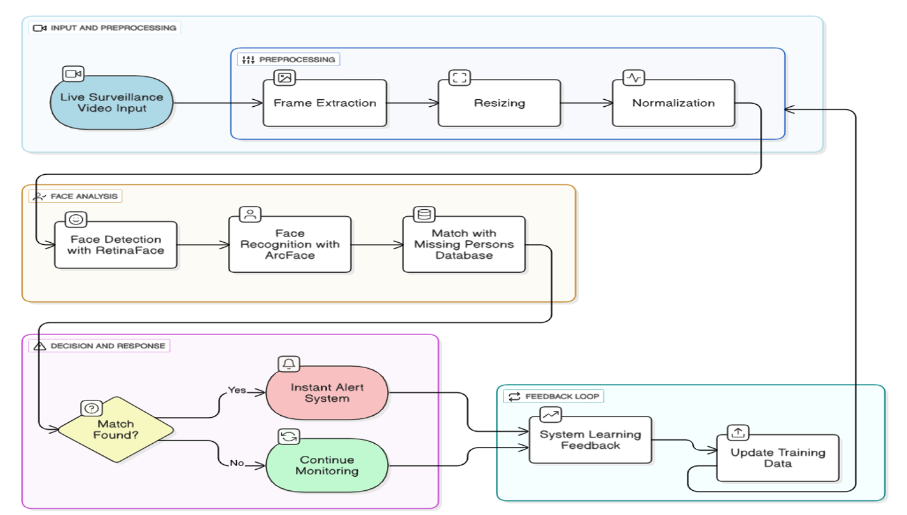
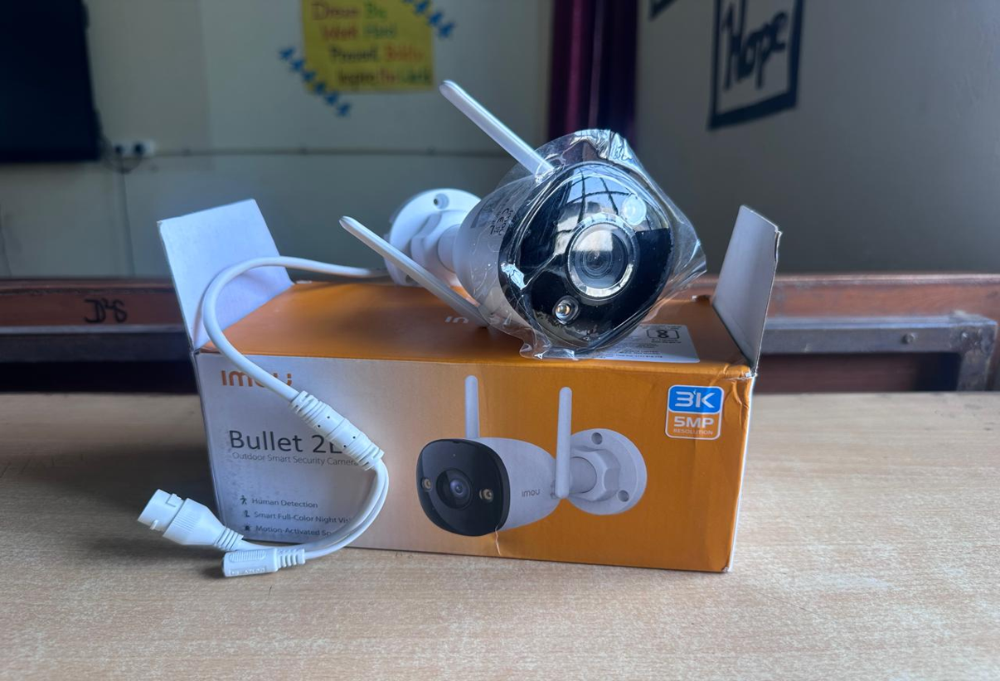
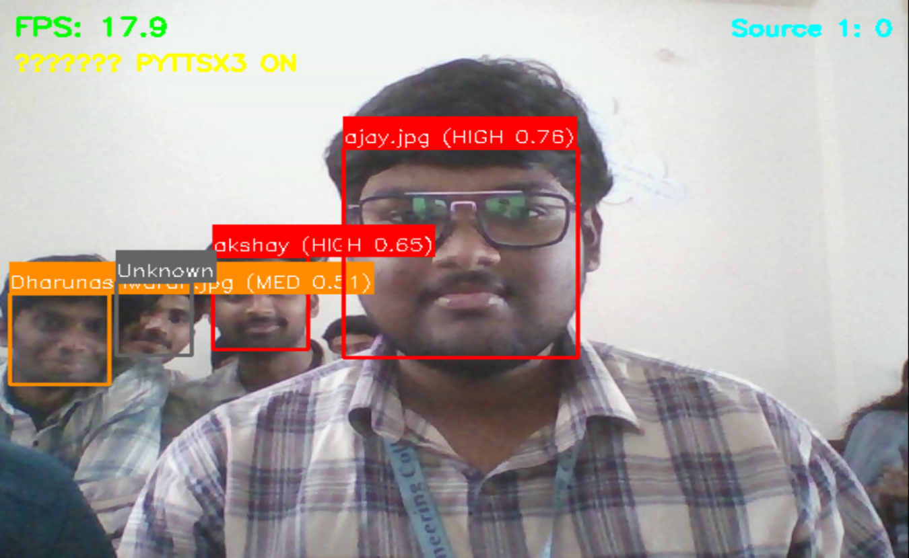
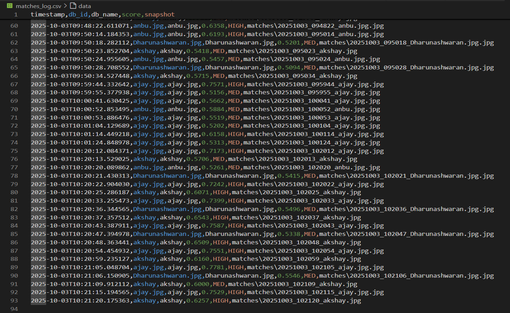

# 🚨 Real-Time Missing Person Detection Using Live Surveillance

## 📌 Overview

The **Real-Time Missing Person Detection System** is an AI-powered surveillance application that detects and identifies missing persons from live CCTV/video streams using facial recognition and computer vision. The system compares faces captured from a live camera with a database of registered missing persons and generates real-time alerts through an interactive web dashboard.

---

# ✨ Features

* 🔍 Real-time Face Detection
* 👤 Face Recognition
* 📹 Live CCTV Monitoring
* 🚨 Automatic Alert Generation
* 📊 Interactive Web Dashboard
* 📝 Detection History
* ⚡ Real-time Monitoring
* 📈 Detection Logging

---

# 🛠️ Tech Stack

### Programming Language

* Python

### Computer Vision

* OpenCV
* face_recognition (dlib)
* NumPy

### Backend

* Flask

### Frontend

* HTML
* CSS
* JavaScript

### Database

* Image Database

---

# 📂 Project Structure

```text
Missing-Person-Detection-System/
│
├── assets/
│   ├── architecture.png
│   ├── camera_we_used.png
│   ├── detection.png
│   ├── input.png
│   ├── matches_log.png
│   └── snapshot_during_detection.png
│
├── detection_system/
├── web_dashboard/
├── documentation/
├── requirements.txt
└── README.md
```

---

# 🏗️ System Architecture

<p align="center">
  
</p>

---

# 📷 Camera Used

<p align="center">
  
</p>

---

# 🎥 Input Video

<p align="center">
  
</p>

---

# 🎯 Detection Result

<p align="center">
  
</p>

---

# 📸 Snapshot During Detection

<p align="center">
  
</p>

---

# 📋 Detection Log

<p align="center">
  
</p>

---

# 🚀 Installation

## Clone Repository

```bash
git clone https://github.com/anbumani0908/missing-person-detection-system.git
```

## Move into Project

```bash
cd missing-person-detection-system
```

## Install Dependencies

```bash
pip install -r requirements.txt
```

---

# ▶️ Run the Project

```bash
python start_system.py
```

Open your browser:

```
http://localhost:5000
```

---

# 📊 Workflow

1. Capture live CCTV video.
2. Detect faces in each frame.
3. Encode facial features.
4. Compare with the registered database.
5. Identify matching individuals.
6. Generate real-time alerts.
7. Store detection history.
8. Display the results on the dashboard.

---

# 🚀 Future Improvements

* Multi-camera support
* Mobile application
* SMS & Email alerts
* Cloud database integration
* Face mask detection
* Person tracking
* Higher recognition accuracy

---

# 👨‍💻 Author

**Anbumani V**

📧 Email: [anbumanivenkatesan0908@gmail.com](mailto:anbumanivenkatesan0908@gmail.com)

🔗 LinkedIn: https://linkedin.com/in/anbumani-v-792539274

💻 GitHub: https://github.com/anbumani0908

---

⭐ **If you found this project useful, please consider giving it a star!**


